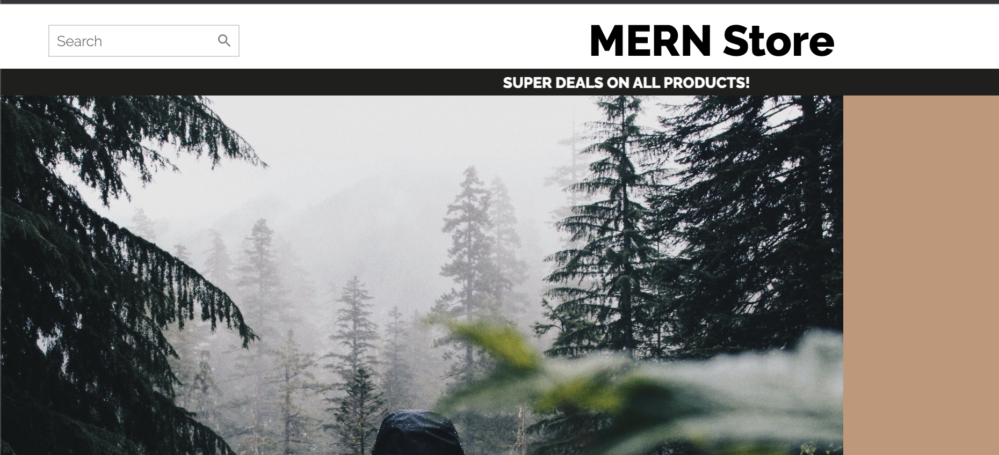

# MERN Store
- [MERN Store](#mern-store)
- [Description](#description)
- [Links](#links)
- [Technologies](#technologies)
- [Future development](#future-development)
- [Contributors](#contributors)
- [License](#license)

# Description

A streamlined and easy to use e-commerce site built on the MERN stack. Users can create an account, browse, add items to their cart, and checkout with Stripe. Users can select from different categories of products or use the curated collections provided.

# Links

- [App](https://ecomm-store-mern.herokuapp.com/)
- [Repository](https://github.com/MatteoThomas/mern-store)

# Technologies

- NodeJS
- React
- Styled Components
- Material UI
- MongoDB / Mongoose
- Express
- Stripe $
- JSON Web Token
- Crypto JS

# Future development

- Fix product image loading
- Add product collections items
- Mobile friendly 

# Contributors

I started this site based on these tutorials:

[React Node Full Stack eCommerce App](https://www.youtube.com/playlist?list=PLj-4DlPRT48mxPG8TAXOH4qqQ1ijuERO4 "Lama Dev's Youtube Page")

# License

